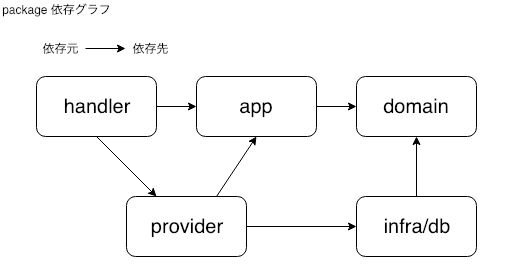

# [Go] Wire を活用した Web API パッケージ構成

## 概要

DI Tool である`Wire`を利用した際の、Web API のパッケージ構成について考えてみました。
また、導入するメリットについてもあわせて記載しております。

[google/wire: Compile-time Dependency Injection for Go](https://github.com/google/wire)

## パッケージ構成

パッケージは下記の通りに組みました。ドメイン層込みのパッケージ構成に、`provider` パッケージを追加しています。  
`provider`パッケージ配下に、`wire`を通して`generate`するコードを配置します。

パッケージ構成

```sh
.
└── wire
  ├── main.go        # package main
  ├── app            # アプリケーション層 (ロジック)
  ├── handler        # API Entrypoint
  ├── provider       # Dependency 管理
  ├── domain         # ドメインモデル 管理
  └── infra          # データ層の実装
      └── db         # DB系実装
```

## 依存関係

パッケージ間の依存関係を簡単な図にしてみました。
`app`パッケージの構造体は、`provider`を経由して、取得するようにしています。



## ソースコード

[api-design/wire](https://github.com/gmidorii/api-design/tree/master/wire)

wire を利用している部分のソースコードは下記のようになっています。
このあたりは、[wire のチュートリアル](https://github.com/google/wire/blob/master/_tutorial/README.md) 等からそのまま利用しています。  
`provider`の役割は、`app`を依存関係を解決した上で生成することになります。  
`app`は`handler`から呼び出すので、下記のように実装します。

```go
package handler

import (
	"io"
	"net/http"

	"github.com/gmidorii/api-design/wire/provider"
)

func Hello(w http.ResponseWriter, r *http.Request) {

	// providerよりapp を取得
	// Hello structにはすでに依存関係が注入されている
	hello, err := provider.InitHelloApp()
	if err != nil {
		return

	message, err := hello.GetMessage("id")
	if err != nil {
		return
	}

	io.WriteString(w, message)
}
```

`handler`以降は、 `app` → `domain` → `infra/db` の順に呼び出して、データを取得しています。  
このあたりに関しては、一般的に考えられているものに沿っているのではないかと考えています。  
参考  
[Go のサーバサイド実装におけるレイヤ設計とレイヤ内実装について考える](https://www.slideshare.net/pospome/go-80591000)

## 良くなった点

wire を導入する前と後で、何が良くなったのかについてですが、2点あると考えています。

* 1. 利用元に変更を加えることなくアプリケーション層の依存性の修正ができる
* 2. 依存関係を作る処理をwireで自動生成することができる


#### 1. 利用元に変更を加えることなくアプリケーション層の依存性の修正ができる

アプリケーション層の実装の際、テスタビリティを上げるため、interfaceを通して互いに依存させ、
実態をInjectするといった実装をします。
この際、コンストラクタインジェクションを利用して、依存性のInjectを実施します。
(Goの場合は、Newはじまり関数を利用して、structを生成します。  
余談: ここでは、フィールドをパッケージプライベートにすることで、外部からはコンストラクタでのみ依存関係を制御するようにしています。)

app package
```go
type Hello struct {
	user domain.UserRepository
}

func NewHello(user domain.UserRepository) Hello {
	return Hello{
		user: user,
	}
}
```

上記の実装の際に、アプリケーション層の仕様が変更され、依存を増やしたい(新しいデータを取りに行きたい)といったことは、
よくあるかと思います。
コードの変更は、依存をコンストラクタで受け取れるように修正し、受け取った依存性をフィールドにつめるようにします。

```go
type Hello struct {
  user domain.UserRepository
  // 増やしたい依存
  book domain.BookRepository
}

// 引数を増やす
func NewHello(user domain.UserRepository, book domain.BookRepository) Hello {
	return Hello{
    user: user,
    booK: book,
	}
}
```

この変更を加えた場合、呼び出し元をすべて修正する必要があります。(コンストラクタの引数が変わったため)

before
```go
user := db.NewUser()
hello, err := app.NewHello(user)
```

after
```go
user := db.NewUser()
book := db.NewBook()
hello, err := app.NewHello(user, book)
```

この変更は、実際に行うと面倒ですし、変更したいところ以外にも差分がでてしまうので、
あまりよろしくないのではないかと思います。
この問題を解決するに当たり、依存関係を管理する中間層(=provider)を用意してあげる方法をとります。
このようにすることで、呼び出し元の修正なく、appの依存関係を変更することができるようになりました。
(※ ちなみにここまでのことは、wireを利用せずとも実現可能です。)

```go
package provider

func InitHelloApp() (app.Hello, error) {
	user := db.NewUser()
	book := db.NewBook()
	hello := app.NewHello(user, book)
	return hello, nil
}
```


#### 2. 依存関係を作る処理をwireで自動生成することができる

では、wireを導入するメリットですが、これは依存関係を解決した上で、コードを自動で生成してくれることに
あるのではないかと思います。
wireで生成するためには、生成元コードが必要になりますが、それは下記のように実装します。  

```go
func InitHelloApp() (app.Hello, error) {
	wire.Build(db.NewUser, app.NewHello)
	return app.Hello{}, nil
}
```

`wire.Build` に依存関係を生成する関数を引数として、渡してあげるだけです。あとは、wire側で依存関係を整理して、コードを生成してくれます。

生成後
```go
func InitHelloApp() (app.Hello, error) {
	userRepository := db.NewUser()
	hello := app.NewHello(userRepository)
	return hello, nil
}
```

特筆すべき点は、 *hello structにuserRepositoryが必要であることを読み取って、生成する順序を自動で調整してくれる点* です。
`wire.Build()` に渡す順番を実装者は意識する必要はありません。(適当な順番で渡してもうまく生成してくれました。)  
また、依存が足りない場合は、生成時にエラーを吐いてくれます。

エラー例
```
wire gen github.com/gmidorii/api-design/wire/provider
github.com/gmidorii/api-design/wire/provider: generate failed
~/src/github.com/gmidorii/api-design/wire/provider/hello.go:11:1: inject InitHelloApp: no provider found for github.
com/gmidorii/api-design/wire/domain.UserRepository
```


## 所感

wireを実際のプロダクトコードで利用する際は、どういった構成にすれば良いか、実装してまとめてみました。
記載したメリットの他に、依存性を切り出す意識をパッケージ構成レベルですることができるので、テスタブルなコードを強制できる点も、
良いのではないのかなぁと思いました。実際に使っていきたいと思います。


## 参考

- [Go のサーバサイド実装におけるレイヤ設計とレイヤ内実装について考える](https://www.slideshare.net/pospome/go-80591000)
- [The Go 1.11 Dockerfile – Pierre Prinetti – Medium](https://medium.com/@pierreprinetti/the-go-1-11-dockerfile-a3218319d191)
