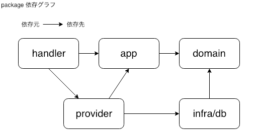

# [Go] Wire を活用した Web API パッケージ構成

## 概要

DI Tool である Wire を利用した際のパッケージ構成について考えてみました。

## パッケージ構成

パッケージは下記の通りに組みました。ドメイン層込みの  パッケージ構成に、`provider` パッケージを追加しています。  
`provider`パッケージ配下に、`wire`を通して`generate`するコードを配置します。

```sh
.
└── wire
  ├── main.go        # package main
  ├── app            # ロジック
  ├── handler        # API Entrypoint
  ├── provider       # Dependency 管理
  ├── domain         # ドメインモデル 管理
  └── infra          # データ層の実装
      └── db         # DB系実装
```

## 依存関係

パッケージ間の依存関係を簡単な図にしてみました。
`app`パッケージの構造体は、`provider`を経由して、取得するようにしています。



## ソースコード
[]()


## 良くなった点

- 利用元に変更を加えることなくアプリケーション層の依存性の修正ができる
- 依存関係を作る部分を provider で一括管理できるため、New が多用されない

## 参考

- [Go のサーバサイド実装におけるレイヤ設計とレイヤ内実装について考える](https://www.slideshare.net/pospome/go-80591000)
- [The Go 1.11 Dockerfile – Pierre Prinetti – Medium](https://medium.com/@pierreprinetti/the-go-1-11-dockerfile-a3218319d191)
