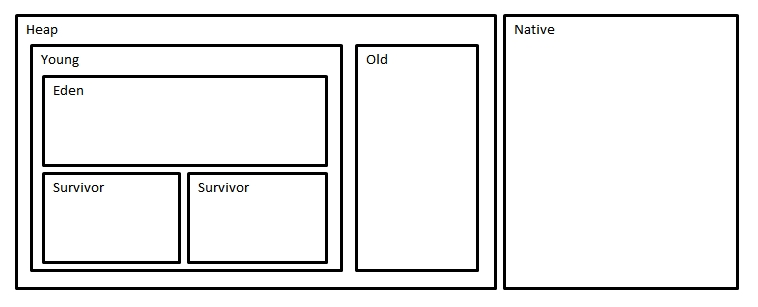

<!-- page_number: true -->
<!-- $size: 4:3 -->


# パーフェクトJava
## 1章 Javaの概要

---

# Java概論
## 特徴
- OOP(オブジェクト指向)
- *静的型* づけ
- Java Virtual Machine上で実行
	-  JVM自体がマルチプラットフォーム対応
- ガベージコレクションによる自動メモリ管理

---

# OOP (Object-Oriented Programing)
- OOPを意識して設計されている
  - 構文
  - ライブラリ
  - → OOPを理解して実装する必要あり

---

# 静的型付け
- プログラミング言語=静的型付け
  - 動的型付けはメンテできません
  - 読めないので (冗談だと思いたい)
- 動的との違い
  - 静的: 型の整合性を「コンパイル」時にチェック
  - 動的: 型の整合性を「実行」時にチェック
- 型推論はありません(Goと違って)
  - 毎回、型は頭に書く(セミコロンも)
  - 次のJavaで入りそう [JEPS286](http://openjdk.java.net/jeps/286)
    - `var hoge = "hoge";`
    - なぜvarなのか
- JEPS ([JDK Enhancement Proposal](http://openjdk.java.net/jeps/0))

---

# GC


[OOMの調べ方](https://qiita.com/opengl-8080/items/64152ee9965441f7667b#java-%E3%81%AE%E3%83%A1%E3%83%A2%E3%83%AA%E7%AE%A1%E7%90%86%E3%80%80)  
→ この記事にだいたい書いてある
→ GC調査の手法とかも
→ 以下抜粋

---

# GC
## Heap
  - JVM上で動く Java プログラムのためのメモリ領域
  - JVMが動作するメモリは除かれる
## Native
  - JVMが動作するメモリ
  - Permanent領域

---

# Heap
## Young 領域
  - 若いオブジェクトが配置される
## Old 領域
  - Youngに一定期間生き続けたオブジェクトが配置される

---

# Young 領域
## Eden 領域
  - オブジェクト生成時にまず配置
## Survivor 領域 (x2)
  - EdenがGCされたときに配置
  - **片方は必ず空**

---

# GC(再掲)


---

# GCの流れ
[このスライド最高](http://cco.hatenablog.jp/entry/2014/12/01/162240)

1. `Eden`に放り込まれる
2. `Eden`が一杯になると`Survivor1`へ入る = `Minor GC`
   - Scavenge GC (Copy GC)
3. `Eden`が一杯になると`Survivor2`へ入る + `Survivor1->2`へ入る
   - --MaxTeuningThreshold オプション
4. `Survivor`間を往復した回数が一定数超えると`Old`へ行く
5. `Old`が一杯になると = `Major` GC (STWは短い)
   - Concurrent Mark&Sweap GC (一応アプリと並行で動く)
   - コンパクト化しない
6. `Old`が一杯+α `FullGC`
   - α = (断片化により割当不能 or GCが間に合わない)
   - Mark&Sweap GC (STW伴う)
---

# メモリ調査
- だいたいjcmdでやる模様 (JDK7以降)
  - `jcmd 0 help` でコマンド一覧
- `jps`/ `jcmd -l`
  - JVM上で動作しているプロセスを調べる
- heap dump
  - `jcmd $PID GC.heap_dump heapdmp.hprof`
- `jstat`
  - メモリ状況モニター
  - `jstat -gc -h5 $PID 1s`
  - `jstat -gcutil -h5 $PID 1s`

---


# JVM
- Javaの実行環境
- `javac` コマンドでコンパイル
- Javaはコンパイル後、JVM用のマシン語を出力
  - 従来はハードウェア依存(C/Goとか)
  - JVMが動けばどこでも動く (JVMがないといらない子)
- JIT(Just in Time)コンパイル
  - 仮想マシン語→ネイティブコードへ実行中に変換
  - 速度向上が目的?

---

# 言語区別
#### コンパイル言語(C,Go)
- ネイティブコード(ハードウェアに依存したマシン語)にコンパイル
- 速い

#### 仮想マシン言語(Java)
- 仮想マシン後にコンパイル

#### インタプリタ言語
- JS, Python

---

# Javaプログラミング初歩
- Javaプログラミング=クラス定義を書くこと
- 1つのソースコードに1クラス
- ファイル名とクラス名を一致させる

```java
public class Main {
 public static void main(String[] args) [
   System.out.println("Hello World");
 }
}
```

```sh
# コンパイル
% javac Main.java

# 実行
% java Main
```

---

# 設計と抽象化
## 分割統治
- 部分ごとに注力
- 各部分の依存性を小さくする
- 部分ごとに **適切な名前** をつける
- 変更制御のキーポイント
  - 依存の制御
  - 不変の作り込み
- これは **原則**

---

# 設計と抽象化
## 抽象化
- プログラミングあらゆる技法は、いかに **抽象化** するかにかかっている
- 本書の重要なとこ

## OOP
- 抽象化+原則に基づく設計手法
- オブジェクト=分割した役割/責務
- オブジェクト指向は、役割により分割し複雑さを減らす技法

---
# 参考
- [Marp記法](https://qiita.com/pocket8137/items/27ede821e59c12a1b222)
- https://www.gixo.jp/blog/5963/
- http://d.hatena.ne.jp/kazu-yamamoto/20130308/1362724125
- https://blog.jetbrains.com/jp/2017/11/03/819
- [OOMの調べ方](https://qiita.com/opengl-8080/items/64152ee9965441f7667b#java-%E3%81%AE%E3%83%A1%E3%83%A2%E3%83%AA%E7%AE%A1%E7%90%86%E3%80%80)
- [「メモリーを意識してみよう」第2回　GCの仕組みを理解する](http://itpro.nikkeibp.co.jp/article/COLUMN/20060612/240657/?rt=nocnt)
- [JVMのGCの仕組みに入門する](https://qiita.com/taisho6339/items/a6a7954bd473e16706bd)
