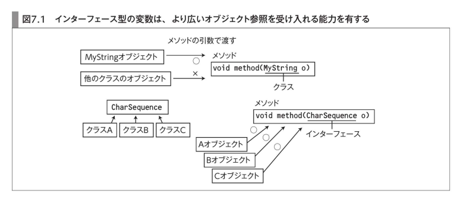
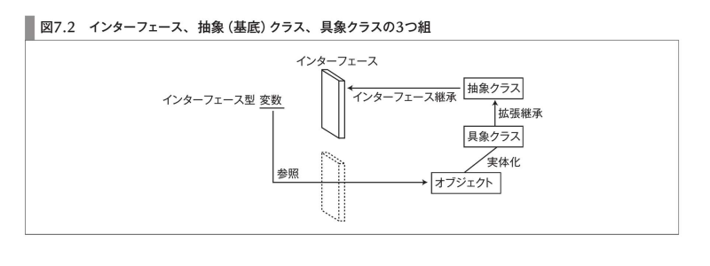
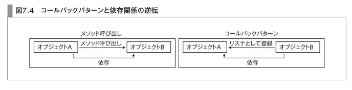

<!-- $theme: default -->

<!-- page_number: true -->
<!-- $size: 4:3 -->

# Perfect Java 7章 Interface

----

# 境界と抽象化

- 規模が大きくなると "機能" と "役割" で分割する
- 全体を組み立てるときに詳細を意識しないようにすると楽
	- 詳細まで見きれない
    - *部品として抽象化することが大事*

→ プログラミングの原理原則

----

# Interface
- Interfaceは型の一つ
  - Javaでは、変数/オブジェクトに型を使える
- 参照型変数の型に使う
  - 参照先のオブジェクトに対して呼べるメソッドを確定する
  - 型→メソッドの流れ

----

# クラスとインターフェース
- クラス
  - 雛形
  - 型定義
- オブジェクトの振る舞いの共通性を担う役割は同じ

## 違い
- Interfaceは雛形ではない
- 型定義に特化した言語機能

----

# Interface

```java
interface HogeInterface {
  void print(); //抽象メソッド
}
public class Hoge implements HogeInterface {
  @Override void print() {
    System.out.println("print");
  }
}
```

----

# Interface型の変数
```java
HogeInterface h = new Hoge();
```

- 参照型変数を通じて呼べるメソッドは型で決まる
- メソッドの本体は、参照先のオブジェクトで決まる

----

# メソッドの引数
```java
class FugaString implements CharSequence {
}

void method(FugaString s) {
  System.out.println("length" + s.length());
}
```
↓ あ、Stringクラス渡したくなったからFugaStringを拡張継承
```java
class FugaString extends String implements CharSequence {
}

void method(String s) {
  System.out.println("length" + s.length());
}
```
→ StringBuilder渡したくなった..終わった..


----

# メソッドの引数

実際は？ これでOK
```java
void method(CharSequence s) {
  System.out.println("length" + s.length());
}
```

----

# メソッドの引数
- 今回の例は、該当クラスがちょうどCharSequenceを継承してるから？
  - 確かに..
- ただ、よく見るとlength()メソッドにしか依存してない!!

#### 要するに
引数の型をInterfaceにすることで、
*「特定の振る舞いをするメソッドをもつオブジェクトを受けるよ！」*
と表明できる
→ 今回だとCharSequence.length()

----

?
# メソッドの引数
3つがlength()メソッドを持ってればよくない?
→ Javaの思想的にNG
↓

## 特別な関係
- 変数の型が、オブジェクトのクラス型と一致
- 変数の型が、オブジェクトのクラスの拡張元クラスと一致
- 変数の型が、オブジェクトのクラスが実装するインターフェースと一致

----

# 多態性 (Polymorphism)
```java
class FugaString implements CharSequence{
  public int indexOf(String str) {}
}

class Hoge {
  public void print(CharSequence c) {
    // エラー
    c.indexOf();
  }
}

// エラー
new Hoge().print(new FugaString());
```
→ 呼び出すメソッドは型に依存
→ ダウンキャストでやる方法は危険なのでNG

----

# 多態性 (Polymorphism)

メソッドの引数
### CharSequenceで渡す
- CharSequenceを実装した任意のクラスのインスタンスを参照できる
→ これこそ多態性



----

# 多態性 (Polymorphism)

### クラスの拡張継承
- 多態性
- 実装コードの共有

### インターフェース
- 多態性

----

# 依存性

実装(クラス)と振る舞い(インターフェース)では経験的に実装が変化しやすい
→ 逆に、変化しづらい振る舞いをインターフェースとして切り出すのが良い

## クラスとインターフェースの適切な使い分け
- 変化しづらい振る舞いをインターフェースにまとめる
- クラスはインターフェースを継承することで変化しづらい部分を表明する
- クラスはインターフェースに依存したコードにより、変化しづらい部分のみへの依存を保証する

----

# インターフェースと抽象クラス
## 同じ
- インスタンス化できない型定義であること

## 違う
- 抽象クラスは雛形としての役割も担う
	- インターフェイス: 振る舞いの規定
	- 抽象クラス: 実装の拡張の役割

----

# インターフェースと抽象クラス


- クラスの拡張継承は、実装の継承のため
- インターフェイスの継承は、振る舞いの継承のため

----

# インターフェースと抽象クラス
- 「振る舞い」インターフェース
- 「実装」クラス

## 現実的な使い分けの指針

### 変数の型
#### インターフェイス
- 境界を意識するコード
- APIとして公開するコード

#### クラス
- それ以外

----

# インターフェース宣言

```java
[修飾子] interface インターフェース名 {
  メンバ宣言
}
```

----

# インターフェースのメンバ

メンバに宣言できるものは？(全部で6つ)

----

# インターフェースのメンバ
- 抽象メソッド
- defaultメソッド
- staticメソッド
- 定数フィールド
- staticなネストクラス
- staticなネストしたインターフェース

----

# インターフェースのメンバ (メソッド)
```java
public GoWriteable interface {

  // public
  String fmtPrint();

  // default
  default errorHandle() {
    System.out.println("if (err != nil) {return err}");
  }

  // static
  static format() {
    System.out.println("go fmt");
  }
}
```

----

# default/staticメソッドの指針

## defaultと抽象クラスの具象メソッド
- まずはインターフェースと抽象クラスのどちらを利用するかを考える
- インターフェースが持つべき振る舞いで典型的な実装があれば「default」

## staticメソッド
- あいまい
- 何もなければインターフェースに「振る舞いの既定」以外の役割は持たせたくない
→ 利用しない

----

# インターフェースのメンバ (フィールド)
```java
public GoWriteable interface {
  // public static final
  String CONCURRENT_WORD = "Do not communicate by sharing memory; instead, share memory by communicating."
}
```

- static初期化ブロックNG = 宣言時に代入

ただ、これももう使わない

----

# 実装
```java
[修飾子] class Hoge implements インターフェース名, インターフェース名 {

}

// ちなみに
[修飾子] class Hoge extends 親クラス implements インターフェース名, インターフェース名 {

}
```

継承したメソッドの修飾子はpublic only

---- 

# defaultメソッドの明示的な呼び出し
```java
public class Hoge implements GoWriteable {

  @Override
  public void errorHandle() {
    // インターフェースのdefault実装を呼び出す
    GoWriteable.super.print();
  }
}

```

----

# インターフェースの拡張継承
- クラスの拡張継承は実装の共有
- インターフェースの拡張継承は振る舞い(宣言)の共有
- 多重継承可 (クラスはNG)

```java
public GoWriteable interface extends TypeScriptWriteable {
}
```

----

# 多重継承
- (再掲) クラスは不可/インターフェースは可

## 大丈夫..?
- 同じシグネチャを持つメソッド
  - 1つだけ実装すればOK
- 同じメソッド名で引数が異なる
  - ただのオーバーロード
- 返り値の型だけ異なる場合
  - シグネチャに返り値型は含まれないためコンパイルエラー
  - 返り値の型同士で継承関係があればOK

----

# 多重継承
## 返り値の型だけ異なる場合
```java
public GoWriteable interface {
  String fmtPrint();
}
pubclic TypeScriptWriteable interface {
  Object fmtPrint();
}

public class Hoge implements GoWriteable, TypeScriptWriteable {
  // Object > String
  @Override
  public String fmtPrint() {
    return "fmt.Println()"
  }
}
```

----

# インターフェースの設計
- コードをインターフェイスに依存させるように意識
- Javaインターフェイスは複数の実装の切り替えに使う(多態性)
  - Collectionの影響で..
  - だがそれだけでない

----

# コールバックパターン (before)
```java
public class Hoge {
  private String replace(String input, String oldStr, String newStr) {
    return input.replaceAll(oldStr, newStr);
  }
  private String capitalize(String input) {
    return input.toUpperCase();
  }

  public String convert(String input) {
    return capitalize(replace(input, "old", "new"));
  }
}

Hoge hoge = new Hoge();
hoge.convert("hoge old.");
```

→ 変換処理が増えるたび実装とconvert()を書き換える必要がある

----

# コールバックパターン (after)
```java
public interface Filter {
  String doJob(String input);
}

public class ReplaceFilter {
  @Override
  public String doJob() {
  	return input.toUpperCase();
  }
}

public class CapitalizeFilter {
  @Override
  public String doJob() {
  	return input.toUpperCase();
  }
}
```

----

# コールバックパターン (after)
(続き)
```java
public class Hoge {
    private List<Filter> filters;
    
    public Hoge(List<Filter> filters) {
    	this.filters = filters;
    }
    
    public String convert(String input) {
    	String output;
    	filters.forEach(f -> output = f.doJob())
        return output;
    }
}
```

→ 変わりやすい処理(変換部分)をクラス外に追いやりました (Hogeの安定化)
→ 複雑性は変わってないです

----

# イベントドリブンコード
- コールバックパターンの一種
- メソッド呼び出しと依存の向き先を逆にした実装
- A->Bを呼ぶのではなく、BをAに登録する



----

# ストラテジパターン(before)

```java
public class Hoge {
  private String type;
    
  pulblic String convert(String input) { 
    if (Object.equals(type, "TYPE1") {
       return replace(input)
    }
    if (Object.equals(type, "TYPE2") {
       return capitalize(input)
    }
    return input;
  }
}
```

----

# ストラテジパターン(after)
```java
public class Hoge {
  private Filter filter
    
  pulblic String convert(String input) {
    return filter.doJob(input);
  }
}
```

→ 条件分岐をクラス外へ追い出した
→ 不安定な条件分岐が多くある場合は、このパターンを使ってHogeの安定化を図る
