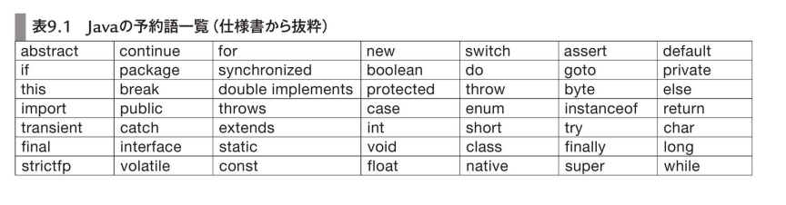
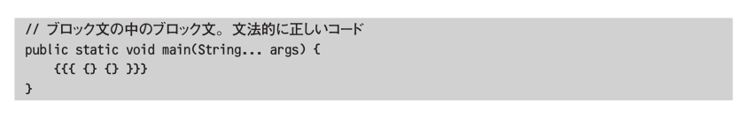

<!-- $theme: default -->

<!-- page_number: true -->
<!-- $size: 4:3 -->

# Perfect Java 9章 

## 文・式・演算子

---

# 文とは?
## 文の定義
- 再帰的定義
  - 文は文により定義 -> その文も ....
  - 永遠? ではない
- 文は最終的に 「予約後」「式」「記号」に分割される
- ちなみに式も再帰的定義
  - 「識別子」「リテラル値」「記号」に分割

---

# 予約語
- Java言語仕様が規定した固定ワードのこと




---

# 識別子
- 開発者がプログラム中に定義するキーワード
  - 変数名、メソッド名、クラス名etc
  - 標準ライブラリ中の文字も当然識別子(System.out.println)

## 文字制約
- 予約語以外の単語
- リテラル値(1, "abc", true)以外の単語
- Unicode文字で始まりUnicode文字が続く単語
- 単語の長さ制限はなし


---

# 識別子: 実際に使う際のルール

**英文字(大/小文字、アンダースコア)で始まり、英文字と数字が続く単語**

---

# 文(Statement)の4要素

- 制御文
- ブロック文
- 宣言文
- 式文

---

# 制御文

10章でやるのでスキップ

---

# ブロック文
- 中括弧 `{}` で文の並びを囲った文
  - 再帰的定義の最たるもの



---

# 宣言文

```java
int i;
```

### (補足) 終端のセミコロン
- 文 ≠ 終端にセミコロンがついたもの
  - ブロック文が違うので

---

# 式文
- 演算子
  - オペレータ
- 演算対象
  - オペランド

```
1 + 1

1 -> オペランド
+ -> 演算子
```

---

# 演算子
- 演算子ごとにオペランドの位置と数が決まっている

## 項
- 2項演算子
- 3項演算子
- 単項演算子
  - 前置演算子
  - 後置演算子


